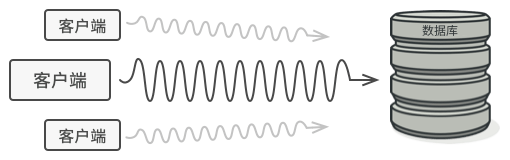
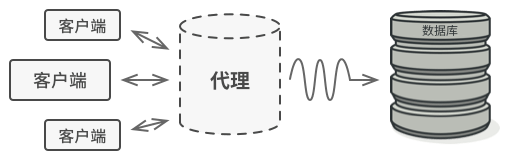
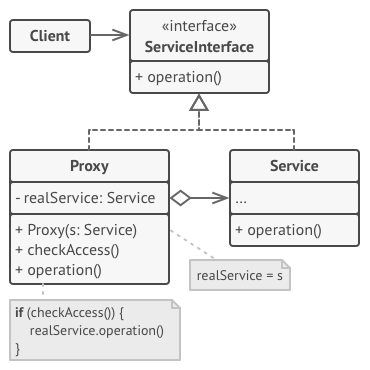

## 模式动机

在某些情况下，一个客户不想或者不能直接引用一个对象，此时可以通过一个称之为“代理”的第三者来实现间接引用。代理对象可以在客户端和目标对象之间起到中介的作用，并且可以通过代理对象去掉客户不能看到的内容和服务或者添加客户需要的额外服务。

通过引入一个新的对象（如小图片和远程代理对象）来实现对真实对象的操作或者将新的对象作为真实对象的一个替身，这种实现机制即为代理模式，通过引入代理对象来间接访问一个对象，这就是代理模式的模式动机。

</img>

## 模式定义

代理模式(Proxy Pattern)：给某一个对象提供一个代理，并由代理对象控制对原对象的引用。代理模式的英文叫做 Proxy 或 Surrogate，它是一种对象结构型模式。

为什么要控制对于某个对象的访问呢？ 举个例子： 有这样一个消耗大量系统资源的巨型对象， 你只是偶尔需要使用它， 并非总是需要。

</img>

你可以实现延迟初始化： 在实际有需要时再创建该对象。 对象的所有客户端都要执行延迟初始代码。 不幸的是， 这很可能会带来很多重复代码。

在理想情况下， 我们希望将代码直接放入对象的类中， 但这并非总是能实现： 比如类可能是第三方封闭库的一部分。

代理模式建议新建一个与原服务对象接口相同的代理类， 然后更新应用以将代理对象传递给所有原始对象客户端。 代理类接收到客户端请求后会创建实际的服务对象， 并将所有工作委派给它。

</img>

如上图所示，代理将自己伪装成数据库对象， 可在客户端或实际数据库对象不知情的情况下处理延迟初始化和缓存查询结果的工作。这有什么好处呢？ 如果需要在类的主要业务逻辑前后执行一些工作， 你无需修改类就能完成这项工作。 由于代理实现的接口与原类相同， 因此你可将其传递给任何一个使用实际服务对象的客户端。

## 模式结构

</img>

- **客户端** （Client）能通过同一接口与服务或代理进行交互， 所以你可在一切需要服务对象的代码中使用代理。
- **服务接口** （Service Interface） 声明了服务接口。 代理必须遵循该接口才能伪装成服务对象。
- **服务** （Service） 类提供了一些实用的业务逻辑。
- **代理** （Proxy） 类包含一个指向服务对象的引用成员变量。 代理完成其任务 （例如延迟初始化、 记录日志、 访问控制和缓存等） 后会将请求传递给服务对象。 通常情况下， 代理会对其服务对象的整个生命周期进行管理。

## 优缺点

代理模式的优点

- 代理模式能够协调调用者和被调用者，在一定程度上降低了系统的耦合度。
- 远程代理使得客户端可以访问在远程机器上的对象，远程机器可能具有更好的计算性能与处理速度，可以快速响应并处理客户端请求。
- 虚拟代理通过使用一个小对象来代表一个大对象，可以减少系统资源的消耗，对系统进行优化并提高运行速度。
- 保护代理可以控制对真实对象的使用权限。

代理模式的缺点

- 由于在客户端和真实主体之间增加了代理对象，因此有些类型的代理模式可能会造成请求的处理速度变慢。
- 实现代理模式需要额外的工作，有些代理模式的实现非常复杂。

根据代理模式的使用目的，常见的代理模式有以下几种类型：

- 远程代理（Remote Proxy）：为一个位于不同的地址空间的对象提供一个本地的代理对象，这个不同的地址空间可以是在同一台主机中，也可是在另一台主机中，远程代理又叫做大使(Ambassador)。
- 虚拟代理（Virtual Proxy）：如果需要创建一个资源消耗较大的对象，先创建一个消耗相对较小的对象来表示，真实对象只在需要时才会被真正创建。
- 延时复制代理（Copy-on-Write  Proxy）：它是虚拟代理的一种，把复制操作延迟到只有在客户端真正需要时才执行。一般来说，对象的深克隆是一个开销较大的操作，Copy-on-Write Proxy 可以让这个操作延迟，只有对象被用到的时候才被克隆。
- 保护代理（Protect or Access Proxy）：控制对一个对象的访问，可以给不同的用户提供不同级别的使用权限。
- 缓冲代理（Cache Proxy）：为某一个目标操作的结果提供临时的存储空间，以便多个客户端可以共享这些结果。
- 防火墙代理（Firewall Proxy）：保护目标不让恶意用户接近。
- 同步化代理（Synchronization Proxy）：使几个用户能够同时使用一个对象而没有冲突。
- 智能引用代理（Smart Reference Proxy）：当一个对象被引用时，提供一些额外的操作，如将此对象被调用的次数记录下来等。